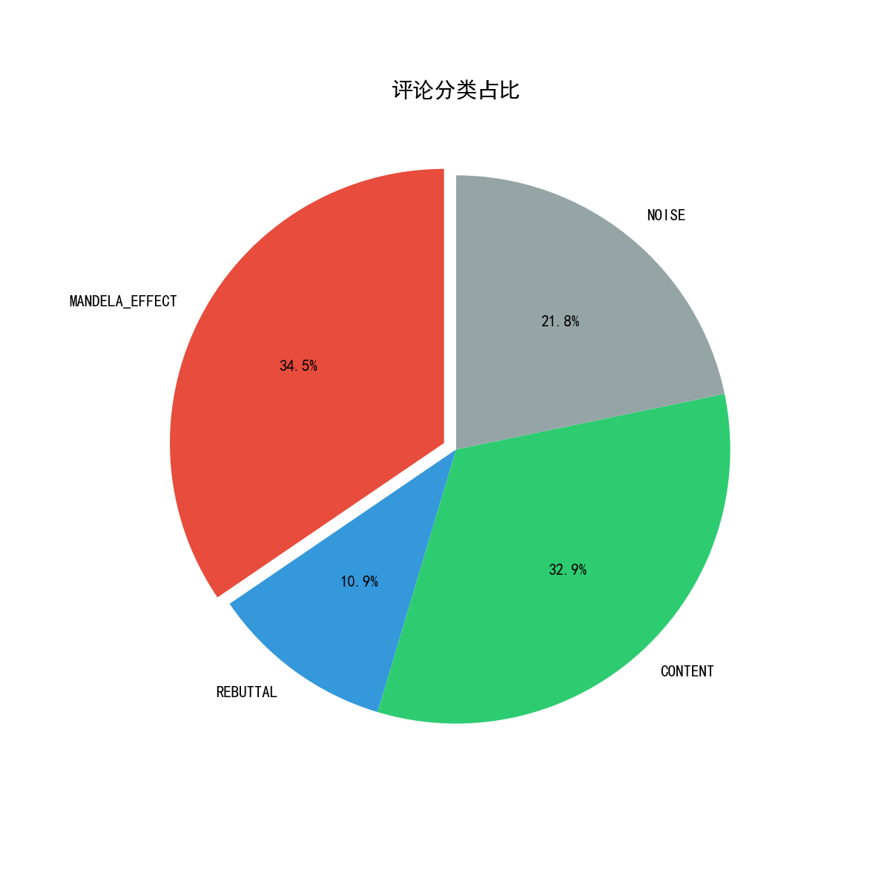
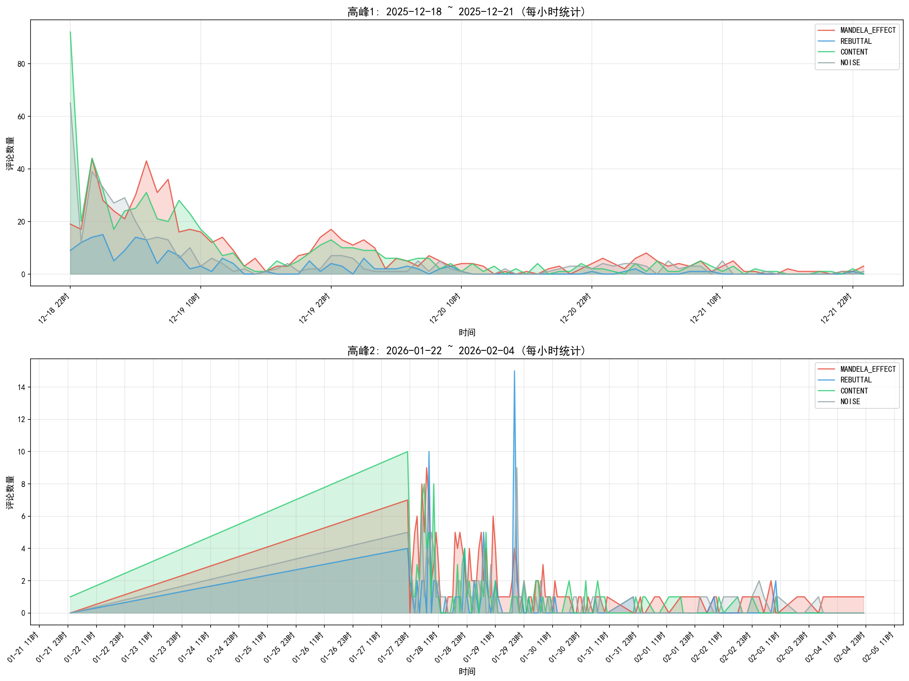
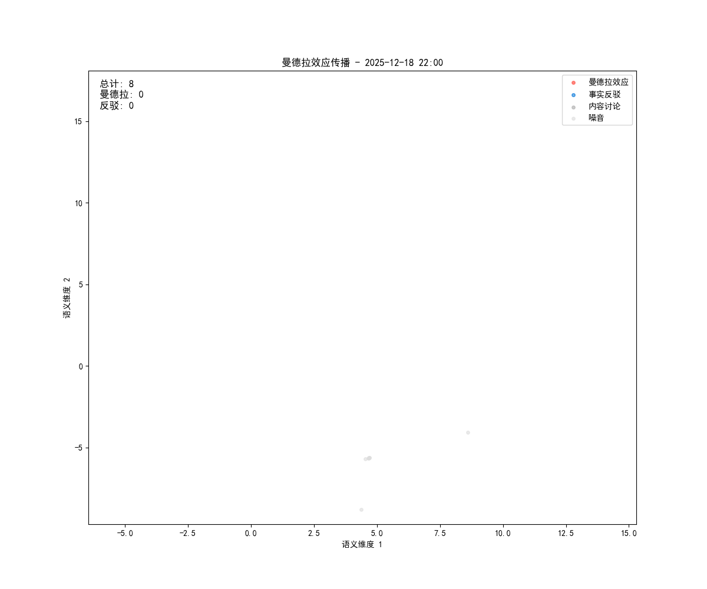

# 曼德拉效应研究项目

基于B站视频评论区的曼德拉效应（Mandela Effect）群体记忆偏差现象研究。

## 研究目标
研究B站科普博主相关视频中出现的曼德拉效应现象，使用LLM对评论进行分类分析，并通过向量化和UMAP降维可视化语义流形。

## 视频信息
- **视频标题**: 费曼说意大利面只能断成三节？我们来给他上一课
- **视频链接**: https://www.bilibili.com/video/BV1cpqpB4Eda/
- **AV号**: av115740040501492
- **BV号**: BV1cpqpB4Eda

## 可视化成果

### 评论分类分布


### 双峰时间分析 (小时级粒度)


### 曼德拉效应传播动画


### 3D语义流形
查看交互式3D可视化: [mandela_3d_manifold.html](data/vectorized/mandela_3d_manifold.html)

## 项目结构
```
MandelaEffect/
├── README.md                      # 本文件
├── config.py                      # Cookie/API配置 (不上传)
├── data/
│   ├── raw/                       # 原始评论数据 (不上传)
│   ├── processed/                 # 处理后数据 (不上传)
│   ├── analysis/                  # 分析结果图表
│   │   ├── category_pie.png       # 分类饼图
│   │   ├── category_trend.png     # 时间趋势图
│   │   ├── dual_peak_hourly.png   # 双峰小时分析
│   │   ├── entity_frequency.png   # 实体词频
│   │   └── mandela_effect_report.json
│   └── vectorized/                # 向量化输出
│       ├── mandela_3d_manifold.html  # 3D交互图
│       ├── mandela_3d_static.png     # 3D静态图
│       ├── mandela_spread.gif        # 传播动画
│       └── metadata.json             # 元数据
├── scripts/
│   ├── bilibili_comments_v5.py    # 评论爬虫
│   ├── build_context.py           # 构建评论树 + 上下文路径
│   ├── llm_analyzer.py            # LLM分析核心
│   ├── batch_analyze.py           # 批量LLM分析
│   ├── data_analysis.py           # 数据统计分析
│   ├── dual_peak_analysis.py      # 双峰时间分析
│   ├── vectorize_and_visualize.py # 向量化 + UMAP可视化
│   └── test_llm.py                # LLM测试脚本
└── notebooks/
    └── analysis.ipynb             # 数据分析notebook
```

## 数据统计
- **爬取时间**: 2026-02-07
- **评论树文件数**: 1325 (每个顶层评论及其回复为一个文件)
- **置顶评论**: 1 条
- **总评论数**: 2616

## 评论树数据格式

### 原始数据 (comments_v2/)
每个JSON文件包含一个顶层评论及其所有回复，回复保留 `parent_id` 用于构建层级：
```json
{
  "id": "评论ID",
  "text": "评论内容",
  "author": "用户名",
  "reply_count": 309,
  "is_top": true,
  "replies": [
    {
      "id": "回复ID",
      "text": "回复内容",
      "author": "用户名",
      "parent_id": "283848159169",  // 直接回复楼主
      "root_id": "283848159169"
    },
    {
      "id": "另一条回复",
      "text": "回复 @某人 :内容",
      "parent_id": "285832978496",  // 回复其他人
      "root_id": "283848159169"
    }
  ]
}
```

### 处理后数据 (with_context/)
为每个节点生成祖先链路上下文，供LLM分析：
```json
[
  {
    "id": "283848159169",
    "author": "毕的二阶导",
    "text": "看到评论区有人说毕导做过这个视频...",
    "depth": 0,
    "context": ""  // 楼主无上下文
  },
  {
    "id": "283849246321",
    "author": "Ph0b1Aa",
    "text": "回复 @成为博士的指挥官 :我确认我之前看的绝对不是这个剪辑风格",
    "depth": 2,
    "context": "楼主(毕的二阶导)说: \"...\"\n上级回复(成为博士的指挥官)说: \"...\""
  }
]
```

## 下一步计划
1. [x] 爬取视频评论 (包含置顶评论 + 完整parent关系)
2. [x] 构建评论树 + 生成上下文路径
3. [x] LLM交互层 (DeepSeek API + 本地Ollama支持)
4. [x] 批量分析全部2616条评论
5. [x] 数据可视化 (分类饼图、时间趋势、双峰分析)
6. [x] 向量化 + UMAP降维 + 3D流形可视化
7. [x] 传播动画生成
8. [ ] 生成研究报告

## LLM分析功能

### 分类类型
| 类型 | 说明 |
|------|------|
| `MANDELA_EFFECT` | 声称有特定记忆（"我记得以前看过"） |
| `REBUTTAL` | 反驳虚假记忆，提供事实依据 |
| `CONTENT` | 仅讨论视频内容，与记忆无关 |
| `NOISE` | 无意义表情、+1、无关内容 |

### 输出格式
```json
{
  "node_id": "comment_103",
  "raw_text": "不对，那肯定是你记错了...",
  "analysis": {
    "category": "REBUTTAL",
    "rewrite_text": "那个视频肯定是你记错了，这博主没发过。",
    "stance": "REFUTE",
    "entities": ["记错", "没发过"]
  },
  "graph_meta": {
    "root_id": "comment_001",
    "parent_id": "comment_005"
  }
}
```

## 使用方法

### 环境要求
- Python 3.x
- Conda环境: basic1

### 运行爬虫
```bash
conda activate basic1
python scripts/bilibili_comments_v5.py
```

### 构建上下文路径
```bash
python scripts/build_context.py
```

### LLM分析 (测试)
```bash
python scripts/test_llm.py        # 测试前10条
```

### LLM分析 (批量)
```bash
python scripts/batch_analyze.py   # 分析全部评论 (约需30分钟)
```
